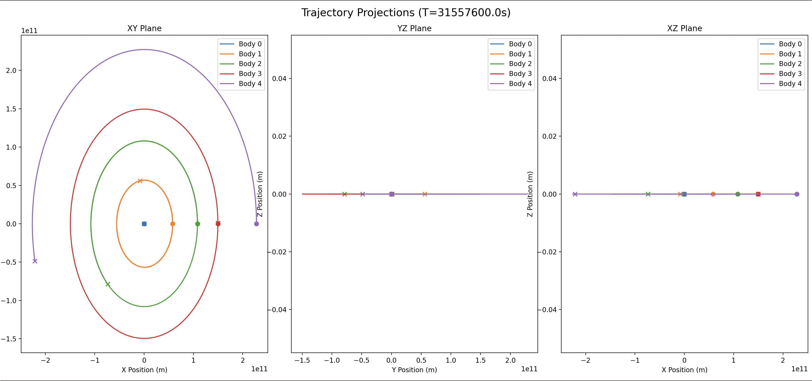
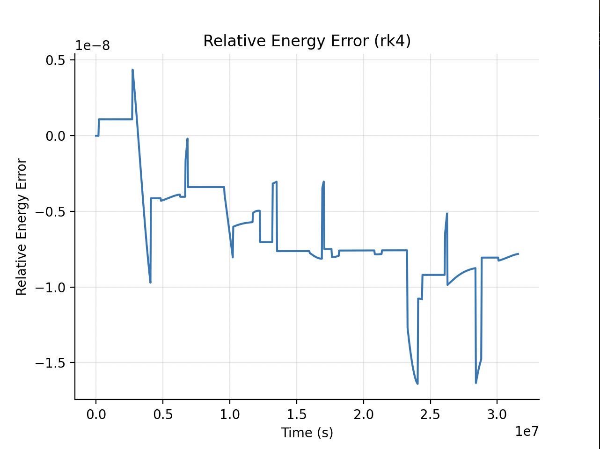
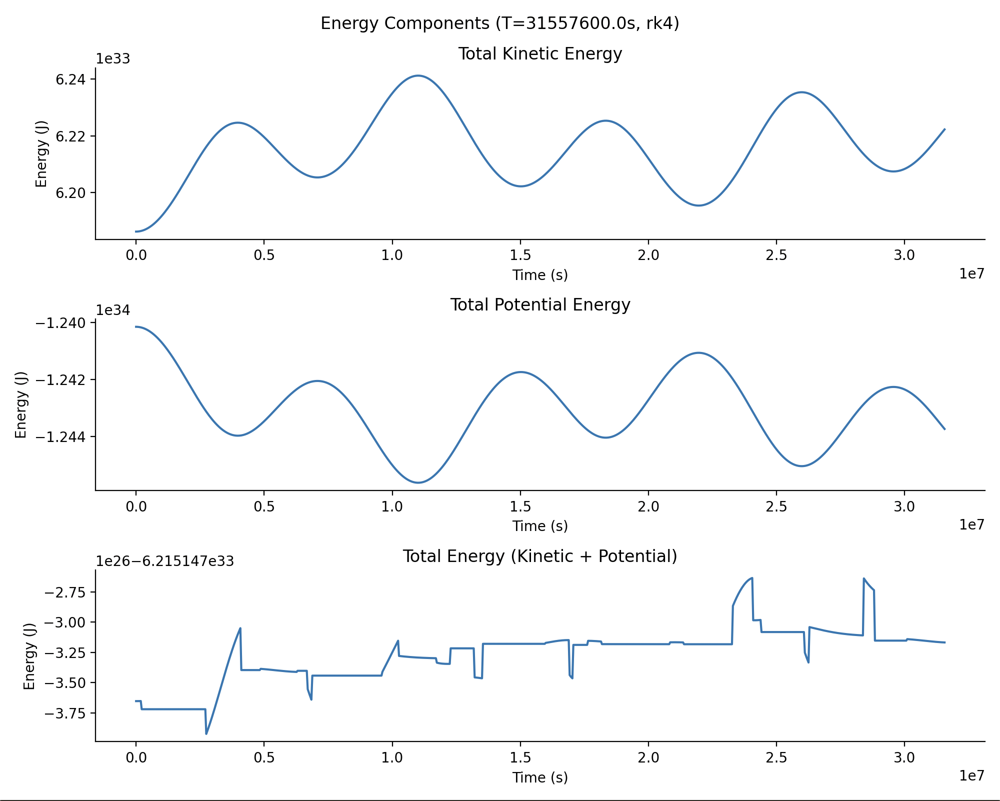
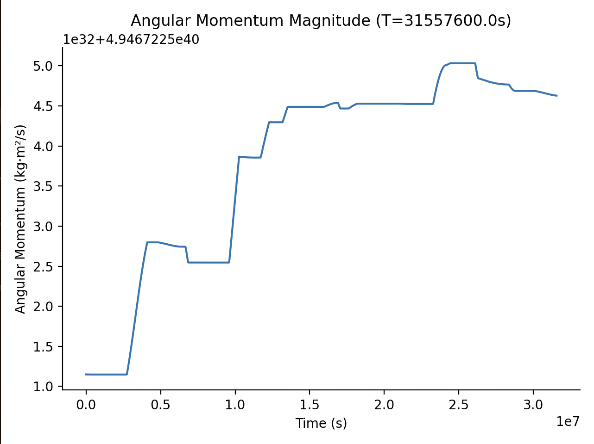

# Neutral Physics Engine

[](https://www.python.org/downloads/)
[](LICENSE)
[](https://github.com/Alameen-datasci/Neutral-Physics-Engine/issues)
[](https://github.com/Alameen-datasci/Neutral-Physics-Engine/stargazers)

**Neutral Physics Engine** is a modular, high-performance engine for gravitational dynamics, collision simulation, multi-integrators, adaptive time stepping, HDF5 telemetry, and scientific computing workflows in Python.

## Core Features
- Barnes-Hut octree spatial acceleration
- Adaptive and Fixed time stepping
- Velocity Verlet, RK4, and Euler integrators
- Broad-Phase collision detection
- Buffered, compressed HDF5 telemetry
- Energy, Momentum, and Projection Analysis
- Scientific benchmarking suite
- Modular architecture for experimentation and extension

## Installation

### 1. Clone the Repository
```bash
git clone https://github.com/Alameen-datasci/Neutral-Physics-Engine.git
cd Neutral_Physics_Engine
```

### 2. Install Dependencies
```bash
pip install -r requirements.txt
```

### 3. Install the Package (Recommended)
```bash
pip install -e .
```

This allows you to import the engine as `neutral_physics_engine` from anywhere

## Quick Start
### Example: Inner Solar System (1-Year Simluation)

```python
from neutral_physics_engine.body import Body
from neutral_physics_engine.io import HDF5Writer
from neutral_physics_engine.integrators import rk4
from neutral_physics_engine.simulation import Simulation
from neutral_physics_engine.gravity_field import GravityField

# Define Bodies
sun = Body(mass=1.989e30, pos=[0.0, 0.0, 0.0], vel=[0.0, 0.0, 0.0], radius=6.9634e8)
mercury = Body(mass=3.301e23, pos=[5.79e10, 0.0, 0.0], vel=[0.0, 47400.0, 0.0], radius=2.44e6)
# ... add Venus, Earth, Mars similarly

bodies = [sun, mercury, venus, earth, mars]

with HDF5Writer(
    filename="results/inner_solar_system.h5",
    n_bodies=len(bodies),
    buffer_size=1000,
    metadata={"Simulation": "Inner Solar System", "Integrator": "RK4", "Time Stepping": "Adaptive", "Enable Collisions": "False"}
) as writer:
    
    gravity = GravityField(theta=0.5)
    sim = Simulation(
        bodies=bodies,
        field=gravity,
        integrator=rk4,
        dt=3600,
        time_stepping="adaptive",
        enable_collisions=False,
        hdf5_writer=writer
    )

    sim.run(365.25 * 24 * 3600)
```
### Analysis
```python
from neutral_physics_engine.analysis import Analysis

with Analysis("results/inner_solar_system.h5") as analysis:
    analysis.relative_energy_error()
    analysis.plot_energy_components()
    analysis.plot_projection(planes=["xy", "yz", "xz"])
    print("Energy drift rate:", analysis.energy_drift_rate())
```

## Project Vision

Neutral Physics Engine began as a small physics simulation project and evolved into a computational physics platform focused on scalable simulation architecture, numerical methods, and performance-oriented engineering. The project serves as a practical exploration of high-performance computing concepts, specifically targeting spatial algorithms, adaptive numerical integration, efficient telemetry pipelines, and scientifically rigorous software design.

## Architecture
The codebase strictly separates physical state, numerical integration, spatial structures, and data I/O.
```txt
neutral-physics-engine/
├── README.md
├── requirements.txt
├── pyproject.toml
├── LICENSE
├── CHANGELOG.md
├── .gitignore
│
├── benchmarks/
│   ├── benchmark_results/
│   ├── adaptive_stepping.py
│   ├── collision_stress.py
│   ├── hdf5_performance.py
│   ├── integrator_comparison.py
│   ├── scaling.py
│   └── theta_tradeoff.py
│
├── examples/
│   ├── results/
│   ├── binary_star_system.py
│   ├── inner_solar_system.py
│   ├── random_n_bodies.py
│   ├── result_analysis.py
│   └── sun_earth.py
│
├── src/
│   └── neutral_physics_engine/
│       ├── analysis.py
│       ├── body.py
│       ├── collision.py
│       ├── gravity_field.py
│       ├── integrators.py
│       ├── io.py
│       ├── octree.py
│       └── simulation.py
│
│
└── tests/
    ├── test_body.py
    ├── test_collision.py
    ├── test_integrators.py
    ├── test_octree.py
    └── test_simulation.py
```

## Numerical Methods
The engine provides several ODE solvers to balance computational cost with mathematical stability:
- **Velocity Verlet:** A second-order symplectic integrator. Because it explicitly preserves the phase-space volume of Hamiltonian systems, it provides excellent long-term bounded energy error behavior, making it the default choice for orbital mechanics.
- **Runge-Kutta 4 (RK4):** A highly precise fourth-order non-symplectic integrator, ideal for transient, short-timescale accuracy.
- **Adaptive Stepping:** Uses step-doubling (Richardson extrapolation) to estimate local truncation errors. If the error exceeds the defined tolerances, the step is rejected, and Δt is dynamically shrunken to maintain strict error bounds.
## Performance Engineering
To handle dense N-body simulations in Python, the engine relies on several optimization strategies:
- **Barnes-Hut Octree:** Replaces the O(N^2) direct summation of gravitational forces with an O(NlogN) tree traversal, controlled by an adjustable multiplexing parameter (`theta`).
- **Memory Footprint:** Heavy use of `__slots__` on foundational classes (`Body`, `Node`) prevents dictionary allocation overhead, drastically reducing RAM usage and improving cache locality for millions of reads.
- **Hot-Loop Unrolling:** Replaced heavily dispatched NumPy function calls (`np.linalg.norm`) in innermost loops with explicit 3D scalar math, bypassing Python overhead during tree traversal and narrow-phase collision checks.
- **Asynchronous-style I/O:** The `HDF5Writer` caches simulation frames in pre-allocated contiguous NumPy arrays, dumping them to disk in large blocks via extendable HDF5 datasets to prevent I/O throttling.
## Benchmark Suite
The `benchmarks/` directory contains tools to quantify engine behavior:
- `scaling.py`: Validates the O(NlogN) time complexity scaling of the octree implementation against a direct computation baseline.
- `theta_tradeoff.py`: Quantifies the mathematical error introduced by the Barnes-Hut approximation at various `theta` opening angles.
- `integrator_comparison.py`: Tracks secular energy drift rates between symplectic and non-symplectic solvers over long time periods.
- `hdf5_performance.py`: Evaluates the disk write overhead and file size footprints at various memory buffer sizes.
- `collision_stress.py`: Isolates and evaluates the performance of the O(NlogN) broad-phase pair-finding algorithm, measuring time-to-detection across scaling body counts independently of advancing the kinematic state.
## Testing
The suite uses `pytest` for rigorous physics validation, including:
- **Symplectic Validation:** Proving Velocity Verlet provides excellent long-term bounded energy error behavior in an ideal 1D harmonic oscillator setup compared to Euler divergence.
- **Collision Edge Cases:** Ensuring perfect momentum exchange in elastic collisions and exact velocity zeroing in perfectly inelastic collisions.
- **Time Constraints:** Verifying that exact-time stopping bounds strictly truncate the final simulation Δt to prevent temporal drift.
## Examples
The `examples/` directory contains several pre-configured simulation scenarios ready to run out of the box. These scripts demonstrate how to set up initial conditions and trigger the telemetry pipeline:
- `inner_solar_system.py`: Simulates the orbital mechanics of the Sun and the inner planets.
- `random_n_bodies.py`: A chaotic system of randomly generated masses to test scale and collision stress.
- `sun_earth.py`: A simple two-body orbital demonstration.
- `binary_star_system.py`: Simulates complex orbital dynamics between two identical high-mass bodies.
- `result_analysis.py`: A quick-start template for running telemetry diagnostics on the generated `.h5` files.
## Visualization
The engine strictly decouples the heavy numerical integration loop from visualization to preserve execution speed. Visualization and diagnostics are handled post-simulation via the Analysis context manager (`src/neutral_physics_engine/analysis.py`), which performs memory-efficient reads of the HDF5 datasets to generate:

- 2D orthographic trajectory projections (XY, XZ, YZ planes).
- Macroscopic kinetic, potential, and total mechanical energy graphs over time.
- Global invariant tracking (Linear and Angular Momentum magnitudes).

Below, you can see the diagnostic results generated from a 1-year simulation of the Inner Solar System (`inner_solar_system.py`) using the non-symplectic **RK4 integrator** paired with the **adaptive time-stepping** controller.

### Trajectory Projections
**Overview:** Verifies the physical correctness of the initial conditions. The XY plane shows stable, near-circular orbits for the inner planets, while remaining approximately coplanar given the initial conditions.


### Relative Energy Error
**Overview:** Highlights the adaptive time-stepping controller in action. Because RK4 is non-symplectic, it does not naturally conserve energy. However, the sharp, step-like artifacts show the controller dynamically resizing Δt to restrict local truncation errors, keeping the global energy drift tightly bounded to ∼1.5×10^−8.


### Energy Components
**Overview:** Demonstrates the continuous macroscopic exchange between Kinetic and Potential energy as the bodies cycle through perihelion and aphelion. Total Energy fluctuations are successfully restricted to the minimal bounds enforced by the adaptive stepper.


### Angular Momentum Magnitude
**Overview:** Verifies the preservation of spatial rotation symmetry (Noether's theorem). The angular momentum remains approximately conserved within numerical precision limits, with only negligible micro-fluctuations occurring at the absolute limits of 64-bit floating-point precision (within numerical precision bounds).


## Future Work
The architectural foundation laid in this project is designed for further expansion into more complex physical domains and hardware-level optimizations, including:
- **Performance Upgrades:** Exploring CPU parallelization, GPU acceleration, and SIMD instruction utilization.
- **Language & Compilation:** Transitioning hot-loops to a C++ backend or utilizing Python JIT compilation.
- **Physics Expansions:** Implementing full rotational dynamics, generalized rigid body dynamics, and CFD-oriented extensions.
- **Scale:** Enabling distributed simulation across multiple compute nodes.
## Author

Developed by **Al Ameen N**, a BS in Computer Science and Data Analytics student at IIT Patna with interests in computational physics, scientific computing, high-performance simulation systems, and aerospace software engineering.

For details on licensing and version history, please see the `LICENSE` and `CHANGELOG.md` files.